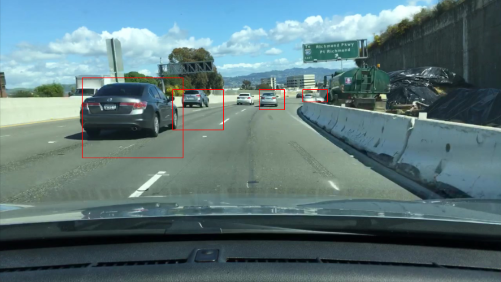
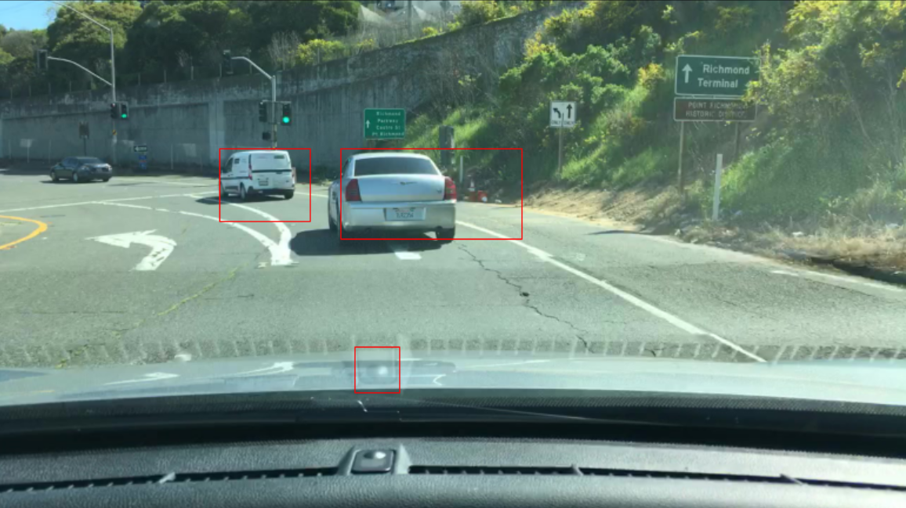
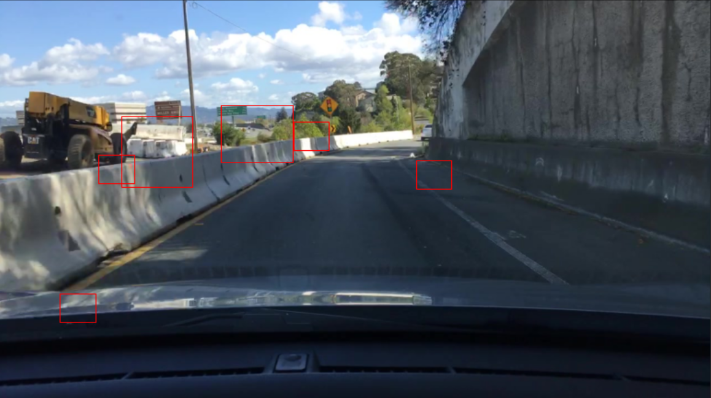

# Object detection using Computer Vision Technics

## Method

### Scale Invariant Feature Transform (SIFT)

My first naive, and stupid, attempt to solve this problem was to simply classify SIFT feature vectors as "part of car" or not. This would have allowed me to then use the "part of car" keypoints density to easily draw the bounding boxes around the car, and get rid of the tedious sliding window process.

However good the final part of the algorithm would be, classifying SVM vectors is impossible and damageable, since they describe more or less "shapes" in the image, and the same shape can appear in a car as well as in any other part of the image.

It took me quite some time to realize this, because the training of SVM was very slow, and the validation set I built was poorly designed.

I have kept the scripts I wrote for that occasion in the `scripts/only_sift` folder, because getting rid of the sliding window is still something that appeal to me.

### History of Gradients (HOG)

After failing miserably, I switched over to the way more classic HOG method, ([link to the paper here](https://hal.inria.fr/file/index/docid/548512/filename/hog_cvpr2005.pdf)). This method is akin to SIFT in the sense that it produces image feature descriptors using gradients, but it differs in the sense that it gives only one, but very long, vector per image, describing it entirely.

The method here is the following:

* Firstly, extract from the training images the positive examples (cars), resize them to a standardized size and compute their HOG descriptor. Mirror the images for easy data augmentation.

* Extract negative examples from the image, resize them to aforementioned size and compute their descriptor. What I chose is to mimic the positive examples' shapes (so picking one shape, and looking for a spot in the image which is not a car and can fit that shape). The point was to have negative examples similar to the positive ones. However, in retrospect I realize it could have been better to only use the shapes I plan on using later on in the detection in itself. But maybe the classification would have been harder to do.  
Anyway, to place the desired shapes in each image, my method is to pick spots at random and check if it intersects car bounding boxes. I do not check for intersection with other negative examples. This method is very time efficient.

* Train a SVM to classify the HOG vectors as "car images" and "background images".

* Then you chose some windows shapes and a stride, and you can just check every sub_image you get by computing its descriptor and passing it through the SVM you trained.

* I also used hard example mining, which is using a well trained SVM to detect some false positives (on the whole set of images) and using these false positives to train a better SVM by adding those "hard examples" to the training data. It improved the performances of the model but I can not say by how much (I did not keep track of the performances before hard example mining).

* Finally, when you have slided your window all over your image, you will most surely have several positive detections overlapping each other for each car. In order to reduce the number of bounding boxes, I performed Non Maximum Suppression (NMS), which is, for every overlapping window keep the one that is the best according to some criterion. The criterion that worked out for me was to use the SVM decision function's value. This is quite intuitive, since the bigger the decision function's value is, the further the image is from the frontier, the more confident one can be in his choice.

## Parameters

There are many parameters to tune in this method, and this is what took the most time:

* Training vectors acquisitions parameters.

* Standard window size.

* HOG parameters.

* SVM parameters.

* Sliding window shapes and strides.

* NMS method and thresholds for intersections.

The only parameters I tuned "accurately" were those of the SVM, since they appeared most important to me (and I had to pick my battles). For those I performed extensive grid searches.  
I set the other parameters by trial and error.

## Executing the code

The data is supposed to be stored in a `data` folder situated at the root of repo. I don't know if I can disclose the data (this is a school project) so I won't.

Everything is situated in the `scripts/hog` folder.

All scripts run very slowly, but most computations are highly parallelizable, and I recommend setting the `--n_processes` parameter for each according to your computational power.

* Training the classifier:
  * with no hard examples you can just use `python -m scripts.hog.train_classifier --model_filename <path/to/save/pickled/model>`

  * with some hard examples you need to use different parameters for the SVM and you should most probably use: `python -m scripts.hog.train_classifier --positive_weight 1 --hard_examples_path <path/to/pickled/hard/examples> --model_filename <path/to/save/pickled/model>`

* Mining hard examples: `python -m scripts.hog.hard_example_mining --classifier_path <path/to/save/pickled/model> --result_path <path/to/save/pickled/hard/examples>`  
Be careful as this can be very slow. I used the option `--n_examples_per_image 5`.

* Detection in test images: `python -m scripts.hog.detect_all --classifier_path <path/to/save/pickled/model> --result_path <path/to/save/results> --test_dir <path/to/test/directory>`  
This script will create two files:
  * a pickle file containing bounding boxes before and after NMS, decision function values and the name of the image file associated.
  * a .csv file containing the format suited for evaluation in this school project.

## Results

This method reached a Dice score of 38 on the test set, which is reasonable. When looking at the results, it can be quite underwhelming compared to state of the art in object detection, but we have to keep in mind that we did not use Deep Learning.

### Examples where it worked well

### Example where it tried its best

